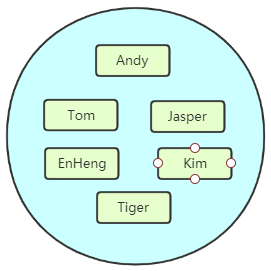

# 从NoSQL说起

NoSQL是Not only SQL的缩写，大意为“不只是SQL”，说明这项技术是<b><font color="red">传统关系型数据库的补充</font></b>而非替代。在整个NoSQL技术栈中<b><font color="blue">MemCache</font></b>、<b><font color="blue">Redis</font></b>、<b><font color="blue">MongoDB</font></b>被称为NoSQL三剑客。那么时代为什么需要NoSQL数据库呢？我们来做个对比：

|              | 关系型数据库             | NoSQL数据库                            |
| ------------ | ------------------------ | -------------------------------------- |
| 数据存储位置 | 硬盘                     | 内存                                   |
| 数据结构     | 高度组织化结构化数据     | 没有预定义的模式                       |
| 数据操作方式 | SQL                      | 所有数据都是键值对，没有声明性查询语言 |
| 事务控制     | 严格的基础事务ACID原则   | 基于乐观锁的松散事务控制               |
| 访问控制     | 细粒度的用户访问权限控制 | 简单的基于IP绑定或密码的访问控制       |
| 外键         | 支持                     | 不支持                                 |
| 索引         | 支持                     | 不支持                                 |

所以NoSQL数据库的最大优势体现为：高性能、高可用性和可伸缩性。

# Redis简介

## 1、基本信息

Redis中文官网介绍：

``` html
Redis是一个开源（BSD许可）的，内存中的数据结构存储系统，它可以用作数据库、缓存和消息中间件。 它支持多种类型的数据结构，如字符串（strings），散列（hashes），列表（lists），集合（sets），有序集合（sorted sets） 与范围查询，bitmaps，hyperloglogs和地理空间（geospatial） 索引半径查询。 Redis 内置了复制（replication），LUA脚本（Lua scripting）， LRU驱动事件（LRU eviction），事务（transactions）和不同级别的 磁盘持久化（persistence）， 并通过Redis哨兵（Sentinel）和自动分区（Cluster）提供高可用性（high availability）。
```

下面是几点补充：

- Redis的名字是Remote Dictionary Server的缩写。
- 开发语言是ANSI C。
- 支持多种不同语言的客户端。
- 官方给出的性能参考
  - GET: 110000/s:读的速度每秒11万次
  - SET: 81000/s: 写的速度每秒8万次

## 2、Redis的应用场景

### ①Redis的典型应用场景：

#### [1]缓存

使用Redis可以建立性能非常出色的缓存服务器，查询请求先在Redis中查找所需要的数据，如果能够查询到（命中）则直接返回，大大减轻关系型数据库的压力。

#### [2]数据临时存储位置

使用token（令牌）作为用户登录系统时的身份标识，这个token就可以在Redis中临时存储。

#### [3]分布式环境下解决Session不一致问题时的Session库

Spring提供了一种技术解决分布式环境下Session不一致问题，叫SpringSession。而Redis就可以为SpringSession提供一个数据存储空间。

#### [4]流式数据去重

在Redis中有一种数据类型是set，和Java中的Set集合很像，不允许存储重复数据。借助这个特性我们可以在Redis中使用set类型存储流式数据达到去重的目的。

### ②Redis不适用的场景

#### [1]直接查询value

Redis是一个严格的Key-value数据库，所有数据都必须通过key去找到value，Redis没有提供直接根据查询条件匹配value的方法。

#### [2]用多键一值表示特定关系

Redis中一个key对应一个value，没有多个key对应同一个value的情况。

#### [3]事务中回滚

Redis不支持回滚。如果一个命令在加入队列时没有检测出问题，那么队列执行时不会因为某一条命令失败而回滚。

# 五、Docker 安装 Redis

## 1.下载镜像

> docker pull redis:5.0.14

也可以获取最新版本

> docker pull redis:lastest

这里我们拉取官方的最新镜像,标签为5.0.14

等待下载完成后，我们就可以在本地镜像列表里查到REPOSITORY为redis,标签为5.0.14的镜像。

```
[root@localhost ~]# docker images
REPOSITORY      TAG       IMAGE ID       CREATED        SIZE
redis           5.0.14    c5da061a611a   7 months ago   110MB
```

## 2.启动redis

>  docker run -d --name redis --net=host -v $PWD/redis/redisData:/data -v $PWD/redis/conf/redis.conf:/etc/redis.conf -v $PWD/redis/redislog:/etc/redislog redis:5.0.14 redis-server /etc/redis.conf --appendonly yes

> 这里有个坑记录一下，如果只是启动后本机访问，不需要指定--net模式，如果需要远程访问，需要指定net=host

从官网下载的配置文件一定是要版本对应的，比如这里时5.0.14版本，就要从官网下载5.0.14的安装文件，从里面获取conf文件

下载conf文件后，可以修改logfile内容，比如修改为
> logfile "/etc/redislog"

这里数据文件放在当前执行路径的redisData目录下

## 3.进入redis容器

> docker exec -it redis /bin/bash

使用redis-cli进入redis

```
先进入docker容器
[root@localhost ~]# docker exec -it redis /bin/bash
进入如下目录
root@1c480b222de4:/data# cd /usr/local/bin
执行redis-cli命令，链接redis
root@1c480b222de4:/usr/local/bin# redis-cli -h 127.0.0.1
127.0.0.1:6379> 
```

# 六、Redis常用数据结构

## 1.总体结构

Redis中的数据，总体上是键值对，不同数据类型指的是键值对中值的类型，key值只能是string类型

## 2.string类型

Redis中最基本的类型，它是key对应的一个单一值。二进制安全，不必担心由于编码等问题导致二进制数据变化。所以redis的string可以包含任何数据，比如jpg图片或者序列化的对象。Redis中一个字符串值的最大容量是512M。

## 3.list类型

Redis 列表是简单的字符串列表，按照插入顺序排序。你可以添加一个元素到列表的头部（左边）或者尾部（右边）。它的底层是双向链表，所以它操作时头尾效率高，中间效率低（额外花费查找插入位置的时间）。<br/>

在Redis中list类型是按照插入顺序排序的字符串链表。和数据结构中的普通链表一样，我们可以在其头部(left)和尾部(right)添加新的元素。在插入时，如果该键并不存在，Redis将为该键创建一个新的链表。与此相反，如果链表中所有的元素均被移除，那么该键也将会被从数据库中删除。List中可以包含的最大元素数量是2^32-1个。<br/>

list是一个有序可以重复的数据类型。


## 4.set类型

Redis的set是string类型的无序集合。它是基于哈希表实现的。set类型插入数据时会自动去重。最大可以包含2^32-1个元素。



## 5.hash类型

本身就是一个键值对集合。可以当做Java中的Map<String,String>对待。每一个hash可以存储2^32-1个键值对。


## 6.zset类型

Redis zset 和 set 一样也是string类型元素的集合,且不允许重复的成员。不同的是每个元素都会关联一个double类型的分数。redis正是通过分数来为集合中的成员进行从小到大的排序。zset的成员是唯一的,但分数(score)却可以重复。


## 7.Geospatial

Redis 在 3.2 推出 Geo 类型，该功能可以推算出地理位置信息，两地之间的距离。

## 8.HyperLogLogs

用于大数据量基数统计，速度非常快，占用内存非常小。每个HyperLogLog键只需要花费12KB内存，就可以计算接近 2^64个不同元素的基数。比如计算网站UV（User view，用户访问数量，一个用户一天访问同一个URL地址多次合并为一次）。

## 9.bitmap

直接对string的二进制位进行操作的一组命令

## 10.常用数据类型应用场景

| 数据类型     | 应用场景                                                     |
| ------------ | ------------------------------------------------------------ |
| string       | 分布式Session存储<br />分布式数据库ID<br />计数器：统计网站访问量 |
| hash         | 存储对象信息（购物车中的商品信息）<br />存储表的信息         |
| list         | 实现队列、栈操作<br />汇总日志<br />粉丝列表<br />关注的人列表 |
| set          | 签到<br />打卡<br />点赞                                     |
| zset         | 排行榜<br />百度热点搜索                                     |
| geospatial   | 获取地理位置信息<br />两地之间的距离                         |
| hyperloglogs | 基数统计                                                     |
| bitmaps      | 统计用户访问次数                                             |

# 七、Redis命令行操作

## 1.Redis命令的小套路

- NX：not exist
- EX：expire
- M：multi

## 2.基本操作

### ①切换数据库

``` html
	Redis默认有16个数据库。
	115 # Set the number of databases. The default database is DB 0, you can select
	116 # a different one on a per-connection basis using SELECT <dbid> where
	117 # dbid is a number between 0 and 'databases'-1
	118 databases 16
	使用select进行切换，数据库索引从0开始
	127.0.0.1:6379> select 2
	OK
	127.0.0.1:6379[2]> select 0
	OK
	127.0.0.1:6379> 
```

### ②查看数据库长度

数据库长度就是这个数据库中存储了多少条数据

``` html
	127.0.0.1:6379> dbsize
	(integer) 3
```

### ③清空全库

```html
	127.0.0.1:6379> flushall
```


## 3.KEY操作

在实际操作中对于Key的定义大家注意下面几点：

- Key不要太长，超过1024字节将消耗过多内存，降低查询效率。尽管Redis支持的Key最大长度为512MB。
- Key仍然要做到见名知意。
- 在同一个项目中遵循同一个命名规范，习惯上多个单词用“:”分开。例如：“user:token:session:id”
- Redis命令不区分大小写，Key区分大小写

``` html
●KEYS PATTERN
	把匹配PATTERN的key返回。PATTERN中可以使用“*”匹配多个字符，使用“?”匹配单个字符
●TYPE KEY
	返回KEY对应的值的类型
●MOVE KEY DB
	把一组键值对数据移动到另一个数据库中~~~~~~~~~~``~~~~~~~~~~
●DEL KEY [KEY ...]
	根据KEY进行删除，至少要指定一个KEY
●EXISTS KEY [KEY ...]
	检查指定的KEY是否存在。指定一个KEY时，存在返回1，不存在返回0。可以指定多个，返回存在的KEY的数量。
●RENAME KEY NEWKEY
	重命名一个KEY，NEWKEY不管是否是已经存在的都会执行，如果NEWKEY已经存在则会被覆盖。
●RENAMENX KEY NEWKEY
	只有在NEWKEY不存在时能够执行成功，否则失败
●TTL KEY
	以秒为单位查看KEY还能存在多长时间
	正数：剩余的存活时间（单位：秒）
	-1：永不过期
	-2：不存在的Key
●EXPIRE KEY SECONDS
	给一个KEY设置在SECONDS秒后过期，过期会被Redis移除。
●PERSIST KEY
	移除过期时间，变成永久key
```

## 4.string操作

``` html
●SET KEY VALUE [EX SECONDS] [PX MILLISECONDS] [NX|XX]
	给KEY设置一个string类型的值。
	EX参数用于设置存活的秒数。
	PX参数用于设置存活的毫秒数。
	NX参数表示当前命令中指定的KEY不存在才行。
	XX参数表示当前命令中指定的KEY存在才行。
●GET KEY
	根据key得到值，只能用于string类型。
●APPEND KEY VALUE
	把指定的value追加到KEY对应的原来的值后面，返回值是追加后字符串长度
●STRLEN KEY
	直接返回字符串长度
●INCR KEY
	自增1（要求：参与运算的数据必须是整数且不能超过整数Integer范围）
●DECR KEY
	自减1（要求：参与运算的数据必须是整数且不能超过整数Integer范围）
●INCRBY KEY INCREMENT
	原值+INCREMENT（要求：参与运算的数据必须是整数且不能超过整数Integer范围）
●DECRBY KEY DECREMENT
	原值-DECREMENT（要求：参与运算的数据必须是整数且不能超过整数Integer范围）
●GETRANGE KEY START END
	从字符串中取指定的一段，索引从0开始
	START是开始取值的索引
	END是结束取值的索引
●SETRANGE KEY OFFSET VALUE
	从offset（从0开始的索引）开始使用VALUE进行替换
	包含offset位置
●SETEX KEY SECONDS VALUE
	设置KEY,VALUE时指定存在秒数
●SETNX KEY VALUE
	新建字符串类型的键值对
●MSET KEY VALUE [KEY VALUE ...]
	一次性设置一组多个键值对
●MGET KEY [KEY ...]
	一次性指定多个KEY，返回它们对应的值，没有值的KEY返回值是(nil)
●MSETNX KEY VALUE [KEY VALUE ...]
	一次性新建多个值
●GETSET KEY VALUE
	设置新值，同时能够将旧值返回

```

## 5.list操作

``` html
●LPUSH key value [value ...]
	针对key指定的list，从左边放入元素
●RPUSH key value [value ...]
	针对key指定的list，从右边放入元素
●LRANGE key start stop
	根据list集合的索引打印元素数据
	正着数：0,1,2,3,...
	倒着数：-1,-2,-3,...
●LLEN key
	返回list集合的长度
●LPOP key
	从左边弹出一个元素。
	弹出=返回+删除。
●RPOP key
	从右边弹出一个元素。
●RPOPLPUSH source destination
	从source中RPOP一个元素，LPUSH到destination中
●LINDEX key index
	根据索引从集合中取值
●LINSERT key BEFORE|AFTER pivot value
	在pivot指定的值前面或后面插入value
	如果pivot值有重复的，那么就从左往右数，以第一个遇到的pivot为基准
	BEFORE表示放在pivot前面
	AFTER表示放在pivot后面
●LPUSHX key value
	只能针对存在的list执行LPUSH
●LREM key count value
	根据count指定的数量从key对应的list中删除value
	具体执行时从左往右删除，遇到一个删一个，删完为止
●LSET key index value
	把指定索引位置的元素替换为另一个值
●LTRIM key start stop
	仅保留指定区间的数据，两边的数据被删除

```

## 6.set操作

``` html
●SADD key member [member ...]
	给key指定的set集合中存入数据，set会自动去重
●SMEMBERS key
	返回可以指定的set集合中所有的元素
●SCARD key
	返回集合中元素的数量
●SISMEMBER key member
	检查当前指定member是否是集合中的元素
	返回1：表示是集合中的元素
	返回2：表示不是集合中的元素
●SREM key member [member ...]
	从集合中删除元素
●SINTER key [key ...]
	将指定的集合进行“交集”操作
	集合A：a,b,c
	集合B：b,c,d
	交集：b,c
●SINTERSTORE destination key [key ...]
	取交集后存入destination
●SDIFF key [key ...]
	将指定的集合执行“差集”操作
	集合A：a,b,c
	集合B：b,c,d
	A对B执行diff：a
	相当于：A-交集部分
●SDIFFSTORE destination key [key ...]
●SUNION key [key ...]
	将指定的集合执行“并集”操作
	集合A：a,b,c
	集合B：b,c,d
	并集：a,b,c,d
●SUNIONSTORE destination key [key ...]
●SMOVE source destination member
	把member从source移动到destination

【测试数据
SADD testset a b c d e f g h i j k l m n o p q r s t u v w x y z aa bb cc dd ee ff gg hh ii jj kk ll mm nn oo pp qq rr ss tt uu vv ww xx yy zz
】

●SSCAN key cursor [MATCH pattern] [COUNT count]
	基于游标的遍历。cursor是游标值，第一次显示第一块内容时，游标取值为0；根据后续返回的新的游标值获取下一块数据。直到游标值变成0，说明数据遍历完成。
●SRANDMEMBER key [count]
	从集合中随机返回count个数量的元素，count不指定就返回1个（数据有可能重复出现）
●SPOP key [count]
	从集合中随机弹出count个数量的元素，count不指定就弹出1个（保证不会有重复数据出现）

```

## 7.hash操作

``` html
●HSET key field value
	插入新数据返回1
	修改旧数据返回0
●HGETALL key
●HGET key field
●HLEN key
●HKEYS key
●HVALS key
●HEXISTS key field
●HDEL key field [field ...]
●HINCRBY key field increment
●HMGET key field [field ...]
●HMSET key field value [field value ...]
●HSETNX key field value
	要求field是新建的
```

## 8.zset操作

``` html
●ZADD key [NX|XX] [CH] [INCR] score member [score member ...]
●ZRANGE key start stop [WITHSCORES]
●ZCARD key
●ZSCORE key member
●ZINCRBY key increment member
●ZRANGEBYSCORE key min max [WITHSCORES] [LIMIT offset count]
	在分数的指定区间内返回数据
●ZRANK key member
	先对分数进行升序排序，返回member的排名。排名从0开始
●ZREM key member [member ...]
```

## 9.Geospatial

查询经纬度数据：http://www.jsons.cn/lngcode

### ①添加地理位置

```redis
GEOADD key longitude latitude member [longitude latitude member ...]
```

> 规则：
>
> 1.两极无法直接添加，一般会下载城市数据，直接通过 Java 程序一次性导入。
>
> 2.取值范围
>
> ​	有效的经度从 -180 度到 180 度。
>
> ​	有效的纬度从 -85.05112878 度到 85.05112878 度。
>
> ​	当坐标位置超出指定范围时，该命令将会返回一个错误。
>
> 3.已经添加的数据，是无法再次往里面添加的。

```html
192.168.109.100:6379> GEOADD "china:city" 114.085947 22.547 shenzhen
(integer) 1
192.168.109.100:6379> GEOADD "china:city" 113.280637 23.125178 guangzhou
(integer) 1
```

### ②查询已添加的地理位置

Geo类型在Redis内部其实是使用zset类型存储的，所以可以使用zset的命令进行常规操作。

```redis
192.168.109.100:6379> ZRANGE china:city 0 -1 
1) "shenzhen"
2) "guangzhou"
192.168.109.100:6379> ZRANGE china:city 0 -1 WITHSCORES
1) "shenzhen"
2) "4046433733682118"
3) "guangzhou"
4) "4046533764066819"
```

### ③删除已添加的地理位置

```redis
192.168.109.100:6379> ZREM china:city guangzhou
(integer) 1
```

### ④获取指定地区的坐标值

```redis
192.168.109.100:6379> GEOPOS china:city shenzhen
1) 1) "114.08594459295272827"
   2) "22.54699993773966327"
```

### ⑤计算两地之间的直线距离

```redis
192.168.109.100:6379> GEODIST china:city guangzhou shenzhen km
"104.6426"
```

> 单位：
>
> m 表示单位为米[默认值]。
>
> km 表示单位为千米。
>
> mi 表示单位为英里。
>
> ft 表示单位为英尺。
>
> 如果用户没有显式地指定单位参数， 那么 GEODIST 默认使用米作为单位。

### ⑥以给定坐标为中心，在指定半径内查找元素

```redis
192.168.109.100:6379> GEORADIUS china:city 110 20 1000 km WITHCOORD WITHDIST
1) 1) "shenzhen"
   2) "509.4622"
   3) 1) "114.08594459295272827"
      2) "22.54699993773966327"
2) 1) "guangzhou"
   2) "485.7406"
   3) 1) "113.28063815832138062"
      2) "23.12517743834835215"
```

WITHCOORD表示显示经纬度<br/>

WITHDIST表示显示到中心的距离

### ⑦在指定元素周围查找其他元素

```redis
192.168.109.100:6379> GEORADIUSBYMEMBER china:city shenzhen 300 km WITHCOORD WITHDIST
1) 1) "shenzhen"
   2) "0.0000"
   3) 1) "114.08594459295272827"
      2) "22.54699993773966327"
2) 1) "guangzhou"
   2) "104.6426"
   3) 1) "113.28063815832138062"
      2) "23.12517743834835215"
```

## 10.hyperloglogs

### ①基数概念

一个集合中不重复元素的个数。例如：集合{1,2,5,1,7,2,5}中元素个数是7，但是基数是4。而hyperloglogs的主要功能就是进行基数统计。

### ②hyperloglogs命令

#### [1]添加

```redis
192.168.109.100:6379> PFADD user:access:1 tom jerry andy jim andy jerry tom
(integer) 1
192.168.109.100:6379> PFADD user:access:2 andy jerry tom bob kate
(integer) 1
192.168.109.100:6379> PFADD user:access:3 mary harry tom jerry
(integer) 1
```

#### [2]统计

```redis
192.168.109.100:6379> PFCOUNT user:access:1 user:access:2 user:access:3
(integer) 8
```

#### [3]合并

```redis
192.168.109.100:6379> PFMERGE user:access:merge user:access:1 user:access:2 user:access:3
OK
192.168.109.100:6379> PFCOUNT user:access:merge
(integer) 8
```

## 11.bitmap位图

直接对数据的二进制位进行操作

```redis
192.168.109.100:6379[5]> set a hello
OK
192.168.109.100:6379[5]> GETBIT a 0
(integer) 0
192.168.109.100:6379[5]> GETBIT a 1
(integer) 1
192.168.109.100:6379[5]> GETBIT a 2
(integer) 1
192.168.109.100:6379[5]> GETBIT a 3
(integer) 0
192.168.109.100:6379[5]> GETBIT a 4
(integer) 1
192.168.109.100:6379[5]> GETBIT a 5
(integer) 0
192.168.109.100:6379[5]> SETBIT a 5 1
(integer) 0
192.168.109.100:6379[5]> get a
"lello"
192.168.109.100:6379[5]> BITCOUNT a
(integer) 22
```

setbit设置指定比特位<br/>
getbit获取指定比特位<br/>
bitcount统计所有比特位中1的数量

# 八、Redis持久化机制
[官网描述](https://redis.io/topics/persistence#snapshotting)

Redis工作时数据都存储在内存中，万一服务器断电，则所有数据都会丢失。针对这种情况，Redis采用持久化机制来增强数据安全性。

## 1.RDB

### ①机制描述

每隔一定的时间把内存中的数据作为一个快照保存到硬盘上的文件中。Redis默认开启RDB机制。

### ②触发时机

#### [1]基于默认配置

``` properties
save 900 1
save 300 10
save 60 10000
```

含义

| 配置          | 含义                                |
| ------------- | ----------------------------------- |
| save 900 1    | 900秒内至少有一次修改则触发保存操作 |
| save 300 10   | 300秒内至少有10次修改则触发保存操作 |
| save 60 10000 | 60秒内至少有1万次修改则触发保存操作 |

#### [2]使用保存命令

save或bgsave

#### [3]使用flushall命令

这个命令也会产生dump.rdb文件，但里面是空的，没有意义

#### [4]服务器关闭

如果执行SHUTDOWN命令让Redis正常退出，那么此前Redis就会执行一次持久化保存。

### ③相关配置

| 配置项     | 取值                   | 作用                                                         |
| ---------- | ---------------------- | ------------------------------------------------------------ |
| save       | ""                     | 禁用RDB机制                                                  |
| dbfilename | 文件名，例如：dump.rdb | 设置RDB机制下，数据存储文件的文件名                          |
| dir        | Redis工作目录路径      | 指定存放持久化文件的目录的路径。注意：这里指定的必须是目录不能是文件名 |

### ④思考

RDB机制能够保证数据的绝对安全吗？

## 2.AOF

### ①机制描述

根据配置文件中指定的策略，把生成数据的命令保存到硬盘上的文件中。一个AOF文件的内容可以参照下面的例子：

``` properties
*2
$6
SELECT
$1
0
*3
$3
set
$3
num
$2
10
*2
$4
incr
$3
num
*2
$4
incr
$3
num
*2
$4
incr
$3
num
```

生成上面文件内容的Redis命令是：

``` html
set num 10
incr num
incr num
incr num
```

### ②AOF基本配置

| 配置项         | 取值              | 作用                                                         |
| -------------- | ----------------- | ------------------------------------------------------------ |
| appendonly     | yes               | 启用AOF持久化机制                                            |
|                | no                | 禁用AOF持久化机制[默认值]                                    |
| appendfilename | "文件名"          | AOF持久化文件名                                              |
| dir            | Redis工作目录路径 | 指定存放持久化文件的目录的路径。注意：这里指定的必须是目录不能是文件名 |
| appendfsync    | always            | 每一次数据修改后都将执行文件写入操作，缓慢但是最安全。       |
|                | everysec          | 每秒执行一次写入操作。折中。                                 |
|                | no                | 由操作系统在适当的时候执行写入操作，最快。                   |

### ③AOF重写

对比下面两组命令：

| AOF重写前                                                   | AOF重写后   |
| ----------------------------------------------------------- | ----------- |
| set count 1<br />incr count<br />incr count<br />incr count | set count 4 |

两组命令执行后对于count来说最终的值是一致的，但是进行AOF重写后省略了中间过程，可以让AOF文件体积更小。而Redis会根据AOF文件的体积来决定是否进行AOF重写。参考的配置项如下：

| 配置项                          | 含义                            |
| ------------------------------- | ------------------------------- |
| auto-aof-rewrite-percentage 100 | 文件体积增大100%时执行AOF重写   |
| auto-aof-rewrite-min-size 64mb  | 文件体积增长到64mb时执行AOF重写 |

实际工作中不要进行频繁的AOF重写，因为CPU资源和硬盘资源二者之间肯定是CPU资源更加宝贵，所以不应该过多耗费CPU性能去节省硬盘空间。

## 3.持久化文件损坏修复

Redis服务器启动时如果读取了损坏的持久化文件会导致启动失败，此时为了让Redis服务器能够正常启动，需要对损坏的持久化文件进行修复。这里以AOF文件为例介绍修复操作的步骤。

- 第一步：备份要修复的appendonly.aof文件

- 第二步：执行修复程序

  /usr/local/redis/bin/redis-check-aof --fix /usr/local/redis/appendonly.aof

- 第三步：重启Redis

注意：所谓修复持久化文件仅仅是把损坏的部分去掉，而没法把受损的数据找回。

## 4.扩展阅读：两种持久化机制的取舍

### ①RDB

#### [1]优势

适合大规模的数据恢复，速度较快

#### [2]劣势

会丢失最后一次快照后的所有修改，不能绝对保证数据的高度一致性和完整性。Fork的时候，内存中的数据被克隆了一份，大致2倍的膨胀性需要考虑，但上述成立有条件，Linux也有优化手段

### ②AOF

#### [1]优势

选择appendfsync always方式运行时理论上能够做到数据完整一致，但此时性能又不好。文件内容具备一定可读性，能够用来分析Redis工作情况。

#### [2]劣势

持久化相同的数据，文件体积比RDB大，恢复速度比RDB慢。效率在同步写入时低于RDB，不同步写入时与RDB相同。

### ③RDB和AOF并存

Redis重启的时候会优先载入AOF文件来恢复原始的数据，因为在通常情况下AOF文件保存的数据集要比RDB文件保存的数据集要完整

RDB的数据不实时，同时使用两者时服务器重启也只会找AOF文件。那要不要只使用AOF呢？作者建议不要，因为RDB更适合用于备份数据库(AOF在不断变化不好备份)、快速重启，而且不会有AOF可能潜在的bug，留着作为一个万一的手段。

### ④使用建议

如果Redis仅仅作为缓存可以不使用任何持久化方式。

其他应用方式综合考虑性能和完整性、一致性要求。

RDB文件只用作后备用途，建议只在Slave上持久化RDB文件，而且只要15分钟备份一次就够了，只保留save 900 1这条规则。如果Enalbe AOF，好处是在最恶劣情况下也只会丢失不超过两秒数据，启动脚本较简单只load自己的AOF文件就可以了。代价一是带来了持续的IO，二是AOF rewrite的最后将rewrite过程中产生的新数据写到新文件造成的阻塞几乎是不可避免的。只要硬盘许可，应该尽量减少AOF rewrite的频率，AOF重写的基础大小默认值64M太小了，可以设到5G以上。默认超过原大小100%大小时重写可以改到适当的数值。如果不开启AOF，仅靠Master-Slave Replication 实现高可用性能也不错。能省掉一大笔IO也减少了rewrite时带来的系统波动。代价是如果Master/Slave同时倒掉，会丢失十几分钟的数据，启动脚本也要比较两个Master/Slave中的RDB文件，载入较新的那个。新浪微博就选用了这种架构。

# 九、Redis事务控制

## 1.Redis事务控制的相关命令

| 命令名  | 作用                                                         |
| ------- | ------------------------------------------------------------ |
| MULTI   | 表示开始收集命令，后面所有命令都不是马上执行，而是加入到一个队列中。 |
| EXEC    | 执行MULTI后面命令队列中的所有命令。                          |
| DISCARD | 放弃执行队列中的命令。                                       |
| WATCH   | “观察“、”监控“一个KEY，在当前队列外的其他命令操作这个KEY时，放弃执行自己队列的命令 |
| UNWATCH | 放弃监控一个KEY                                              |

## 2.命令队列执行失败的两种情况

### ①加入队列时失败

``` html
127.0.0.1:6379> multi
OK
127.0.0.1:6379> set age 20
QUEUED
127.0.0.1:6379> incr age
QUEUED
127.0.0.1:6379> incr age www
(error) ERR wrong number of arguments for 'incr' command
127.0.0.1:6379> exec
(error) EXECABORT Transaction discarded because of previous errors.
```

遇到了入队时即可检测到的错误，整个队列都不会执行。

### ②执行队列时失败

``` html
127.0.0.1:6379> multi
OK
127.0.0.1:6379> set age 30
QUEUED
127.0.0.1:6379> incrby age 5
QUEUED
127.0.0.1:6379> incrby age 5
QUEUED
127.0.0.1:6379> incrby age ww
QUEUED
127.0.0.1:6379> incrby age 5
QUEUED
127.0.0.1:6379> EXEC
1) OK
2) (integer) 35
3) (integer) 40
4) (error) ERR value is not an integer or out of range
5) (integer) 45
127.0.0.1:6379> get age
"45"
```

错误在入队时检测不出来，整个队列执行时有错的命令执行失败，但是其他命令并没有回滚。

### ③Redis为什么不支持回滚

官方解释如下：

> 		如果你有使用关系式数据库的经验， 那么 “Redis 在事务失败时不进行回滚，而是继续执行余下的命令”这种做法可能会让你觉得有点奇怪。以下是这种做法的优点：
> 		1.Redis 命令只会因为错误的语法而失败（并且这些问题不能在入队时发现），或是命令用在了错误类型的键上面：这也就是说，从实用性的角度来说，失败的命令是由编程错误造成的，而这些错误应该在开发的过程中被发现，而不应该出现在生产环境中。
> 		2.因为不需要对回滚进行支持，所以 Redis 的内部可以保持简单且快速。
> 		有种观点认为 Redis 处理事务的做法会产生 bug ， 然而需要注意的是， 在通常情况下， 回滚并不能解决编程错误带来的问题。 举个例子， 如果你本来想通过 INCR 命令将键的值加上 1 ， 却不小心加上了 2 ， 又或者对错误类型的键执行了 INCR ， 回滚是没有办法处理这些情况的。

## 3.悲观锁和乐观锁

在使用WATCH命令监控一个KEY后，当前队列中的命令会由于外部命令的执行而放弃，这是乐观锁的体现。

- 悲观锁

  认为当前环境非常容易发生碰撞，所以执行操作前需要把数据锁定，操作完成后释放锁，其他操作才可以继续操作。

- 乐观锁

  认为当前环境不容易发生碰撞，所以执行操作前不锁定数据，万一碰撞真的发生了，那么检查版本号：

  - 如果是基于最新的版本所做的修改：服务器接受，修改成功
  - 如果是基于旧的版本号所做的修改：服务器不接受，修改失败，整个MULTI队列中的操作都被丢弃

# 十、Redis主从复制机制


## 1.读写分离的好处：

- 性能优化：主服务器专注于写操作，可以用更适合写入数据的模式工作；同样，从服务器专注于读操作，可以用更适合读取数据的模式工作。
- 强化数据安全，避免单点故障：由于数据同步机制的存在，各个服务器之间数据保持一致，所以其中某个服务器宕机不会导致数据丢失或无法访问。从这个角度说参与主从复制的Redis服务器构成了一个<b><font color="blue">集群</font></b>。

## 2.搭建步骤

### ①思路

Redis集群在运行时使用的是同一个可执行文件，只是对应的配置文件不同。


每个配置文件中相同的参数是：

``` html
daemonize yes
dir /usr/local/cluster-redis
```

不同的参数有：

| 配置项名称 | 作用                          | 取值                                                         |
| ---------- | ----------------------------- | ------------------------------------------------------------ |
| port       | Redis服务器启动后监听的端口号 | 6000<br />7000<br />8000                                     |
| dbfilename | RDB文件存储位置               | dump6000.rdb<br />dump7000.rdb<br />dump8000.rdb             |
| logfile    | 日志文件位置                  | /var/logs/redis6000.log<br />/var/logs/redis7000.log<br />/var/logs/redis8000.log |
| pidfile    | pid文件位置                   | /var/run/redis6000.pid<br />/var/run/redis7000.pid<br />/var/run/redis8000.pid |

### ②步骤

- 第一步：创建/usr/local/cluster-redis目录
- 第二步：把原始未经修改的redis.conf复制到/usr/local/cluster-redis目录
- 第三步：把/usr/local/cluster-redis目录下的redis.conf复制为redis6000.conf
- 第四步：按照既定计划修改redis6000.conf中的相关配置项
  - daemonize yes
  - dir
  - port
  - dbfilename
  - logfile
  - pidfile
- 第五步：复制redis6000.conf为redis7000.conf
- 第六步：修改redis7000.conf中的相关配置项
  - port
  - dbfilename
  - logfile
  - pidfile
- 第七步：复制redis6000.conf为redis8000.conf
- 第八步：修改redis8000.conf中的相关配置项
  - port
  - dbfilename
  - logfile
  - pidfile

### ③启动Redis主从复制集群

```html
/usr/local/redis/bin/redis-server /usr/local/cluster-redis/redis6000.conf
/usr/local/redis/bin/redis-server /usr/local/cluster-redis/redis7000.conf
/usr/local/redis/bin/redis-server /usr/local/cluster-redis/redis8000.conf
```

使用redis-cli停止指定服务器的命令格式如下：<br/>
/usr/local/bin/redis-cli -h IP地址 -p 端口号 shutdown

## 3.主从关系

### ①查看主从关系

``` html
127.0.0.1:6000> info replication
# Replication
role:master
connected_slaves:0
```

刚刚启动的集群服务器中每一个节点服务器都认为自己是主服务器。需要建立主从关系。

### ②设定主从关系

在从机上指定主机位置即可

``` html
SLAVEOF 127.0.0.1 6000
```

### ③取消主从关系

在从机上执行命令

``` html
SLAVEOF NO ONE
```

## 4.初步测试

- 测试1：在主机写入数据，在从机查看 --数据写入成功
- 测试2：在从机写入数据报错。配置文件中的依据是：slave-read-only yes
- 测试3：主机执行SHUTDOWN看从机状态 --不配置哨兵模式的情况下，从机仍然是从机
- 测试4：主机恢复启动，看从机状态 --从机重新找到主机
- 测试5：从机SHUTDOWN，此时主机写入数据，从机恢复启动查看状态。重新设定主从关系后看新写入的数据是否同步。 --完全同步主机的最新的数据

## 5.哨兵模式

### ①作用

通过哨兵服务器监控master/slave实现主从复制集群的自动管理。


### ②相关概念

#### [1]主观下线

1台哨兵检测到某节点服务器下线。

#### [2]客观下线

认为某个节点服务器下线的哨兵服务器达到指定数量。这个数量后面在哨兵的启动配置文件中指定。

### ③配置方式

简单起见我们只配置一台哨兵。我们所需要做的就是创建一个哨兵服务器运行所需要的配置文件。

vim /usr/local/cluster-redis/sentinel.conf

| 格式 | sentinel monitor 为主机命名 主机IP 主机端口号 将主机判定为下线时需要Sentinel同意的数量 |
| ---- | ------------------------------------------------------------ |
| 例子 | sentinel monitor mymaster 127.0.0.1 6000 1                   |

### ④启动哨兵

/usr/local/redis/bin/redis-server /usr/local/cluster-redis/sentinel.conf --sentinel

``` html
+sdown master mymaster 127.0.0.1 6379 【主观下线】
+odown master mymaster 127.0.0.1 6379 #quorum 1/1【客观下线】
……
+vote-for-leader 17818eb9240c8a625d2c8a13ae9d99ae3a70f9d2 1【选举leader】
……
+failover-state-send-slaveof-noone slave 127.0.0.1:6381 127.0.0.1 6381 @ mymaster 127.0.0.1 6379【把一个从机设置为主机】

-------------挂掉的主机又重新启动---------------------
-sdown slave 127.0.0.1:6379 127.0.0.1 6379 @ mymaster 127.0.0.1 6381【离开主观下线状态】
+convert-to-slave slave 127.0.0.1:6379 127.0.0.1 6379 @ mymaster 127.0.0.1 6381【转换为从机】
```


# 十一、发布订阅

## 1.订阅一个频道

``` html
127.0.0.1:6379> SUBSCRIBE cctv
Reading messages... (press Ctrl-C to quit)
1) "subscribe"
2) "cctv"
3) (integer) 1

```

## 2.在一个频道上发布信息

```html
127.0.0.1:6379> PUBLISH cctv hai
(integer) 1
```


```html
127.0.0.1:6379> SUBSCRIBE cctv
Reading messages... (press Ctrl-C to quit)
1) "subscribe"
2) "cctv"
3) (integer) 1
1) "message"
2) "cctv"
3) "hai"
```


# 十二、Jedis

## 1.一个对比

|          | MySQL      | Redis     |
| -------- | ---------- | --------- |
| 连接     | Connection | Jedis     |
| 连接池   | C3P0等等   | JedisPool |
| 操作完成 | 关闭连接   | 关闭连接  |

## 2.Redis准备

### ①理解Redis配置文件中bind配置项含义

bind后面跟的ip地址是客户端访问Redis时使用的IP地址。看下面例子：

| bind值          | 访问方式                       |
| --------------- | ------------------------------ |
| 127.0.0.1       | ./redis-cli -h 127.0.0.1       |
| 192.168.200.100 | ./redis-cli -h 192.168.200.100 |

### ②查看Linux系统本机IP

远程客户端访问Linux服务器时不能使用127.0.0.1，要使用网络上的实际IP。可以用ifconfig命令查看。

### ③将Redis配置文件中的bind配置项设置为本机IP。

``` html
bind [你的实际IP]
bind 192.168.200.100
```

## 3.Jedis

```xml
	<dependency>
		<groupId>redis.clients</groupId>
		<artifactId>jedis</artifactId>
		<version>2.9.0</version>
	</dependency>
```

``` java
//指定Redis服务器的IP地址和端口号
Jedis jedis = new Jedis("192.168.200.100", 6379);

//执行ping命令
String ping = jedis.ping();

System.out.println(ping);

//关闭连接
jedis.close();

```

## 4.JedisPool

```java
//声明Linux服务器IP地址
String host = "192.168.200.100";

//声明Redis端口号
int port = Protocol.DEFAULT_PORT;

//创建连接池对象
JedisPool jedisPool = new JedisPool(host, port);

//获取Jedis对象连接Redis
Jedis jedis = jedisPool.getResource();

//执行具体操作
String ping = jedis.ping();

System.out.println(ping);

//关闭连接
jedisPool.close();
```

